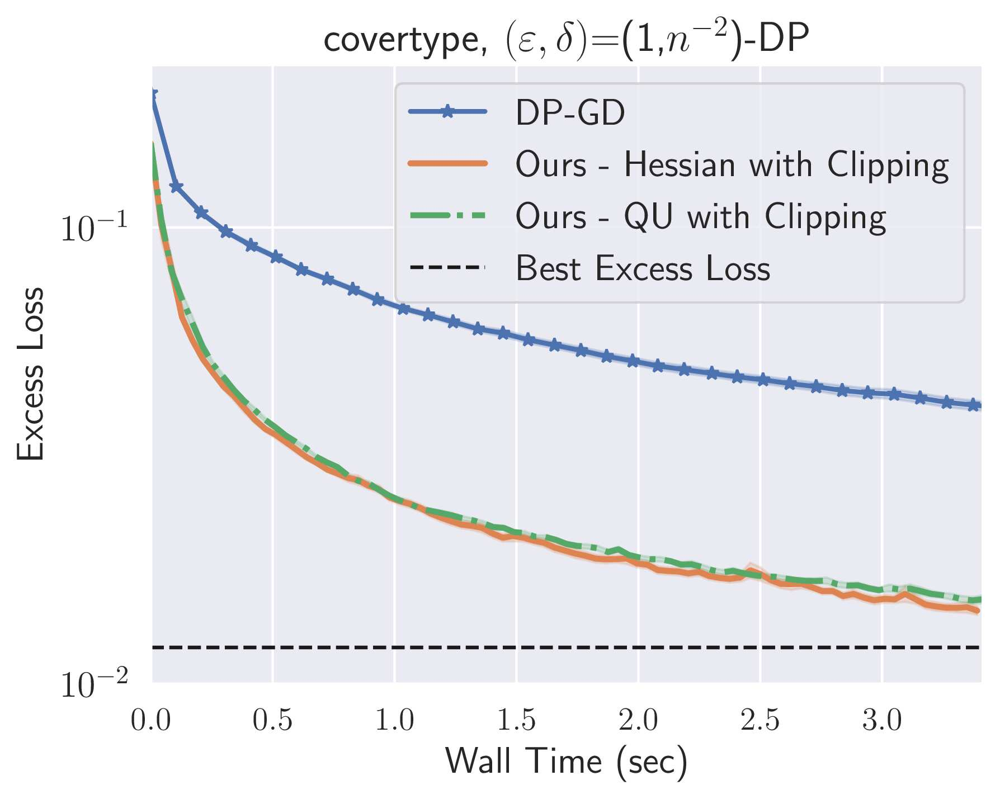

# Second-Order Private Optimization (NeurIPS 2023)

This repo contains the code for the numerical results presented in the following paper. 

**"Faster Differentially Private Convex Optimization via Second-Order Methods"** <br>
**Published at NeurIPS'23**<br>
[[https://arxiv.org/abs/1911.02151](https://arxiv.org/abs/2305.13209)] <br>
by Arun Ganesh, Mahdi Haghifam, Thomas Steinke, Abhradeep Thakurta


---

This code implements **Double-Noise DP Newton-style methods** that:
- leverage curvature to take larger, better-scaled steps,
- **reduce iteration count dramatically**,




---

## What’s inside

### Algorithms
The following algorithms are implemented (identifiers correspond to `alg_type` and keys in results):

- **Double-Noise Mechanism (our method)** — 4 variants:
  - `DN-Hess-add`  : Hessian SOI + eigenvalue **add** regularization  
  - `DN-Hess-clip` : Hessian SOI + eigenvalue **clip** regularization  
  - `DN-UB-add`    : Quadratic upper-bound SOI + **add** regularization  
  - `DN-UB-clip`   : Quadratic upper-bound SOI + **clip** regularization  

- **Baselines**
  - `DPGD` : DP Gradient Descent from [Bassily et al., 2014](https://arxiv.org/abs/1405.7085)
  - `private-newton` : DP Damped Newton baseline from [Avella-Medina et al., 2021](https://arxiv.org/abs/2103.11003) 

### Datasets
Supported via `dataset_loader.py`:
- `a1a_dataset`
- `protein_dataset`
- `fmnist_dataset`
- `synthetic_dataset`
- `covertype_dataset` 

---

## Setup

Install dependencies:
```bash
pip install -r requirements.txt
```

### Examples

#### Running Double Noise Method
```bash
python run.py \
  --datasetname synthetic_dataset \
  --alg_type double_noise \
  --total 1.0 \
  --numiter 10 \
  --grad_frac 0.5 \
  --trace_frac 0.5 \
  --trace_coeff 1.0
```

#### Running DP-GD Baseline
```bash
python run.py \
  --datasetname synthetic_dataset \
  --alg_type dp_gd \
  --total 1.0 \
  --numiter 100
```

#### Running Damped Private Newton
```bash
python run.py \
  --datasetname synthetic_dataset \
  --alg_type damped_newton \
  --total 1.0 \
  --numiter 10 \
  --grad_frac 0.5
```


## Viewing Results
```bash
python print_results.py
```
Results are saved in `src/results/` as JSON files.


## Contact

For questions and feedback:
- **Mahdi Haghifam** - [haghifam.mahdi@gmail.com](mailto:haghifam.mahdi@gmail.com)


